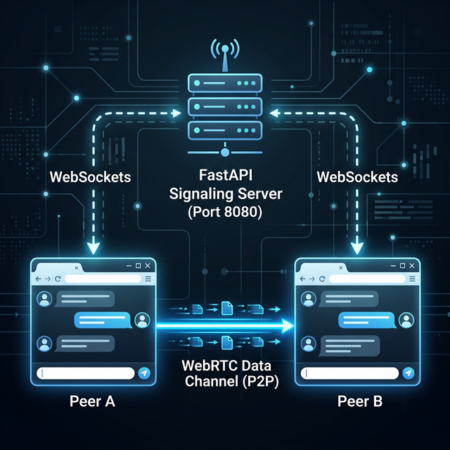

# P2P WebRTC Chat with FastAPI

A truly peer-to-peer secure chat application built with modern web technologies and a lightweight Python backend. 

## Overview

Unlike traditional chat applications (like WhatsApp or Slack) where every message you send goes through a central company server before reaching your friend, this application uses **WebRTC Data Channels** to establish a direct, browser-to-browser connection.

The Python backend (built with FastAPI) simply serves as an initial "Matchmaker" (Signaling Server). It helps the two browsers find each other. Once connected, the chat messages are sent encrypted, directly between peers, and the Python server is no longer involved.

## Architecture

This project is divided into two parts executing simultaneously:
1. **The Signaling Server (Python/FastAPI):** Serves the HTML, CSS, and JS files, and handles WebSockets.
2. **The Clients (Browsers):** Handle the user interface, WebRTC negotiation, and establish the P2P connection.

### How it Works (Signaling & Connection Flow)

WebRTC requires an exchange of connection information (called SDP Offers/Answers and ICE Candidates) before a direct connection can be established. 



1. **Setup Phase:** Both peers load the web app from the FastAPI server.
2. **Signaling Phase:** They connect to the Server's WebSocket (`/ws`) to securely exchange connection parameters.
3. **P2P Phase:** A direct WebRTC Data Channel is established between the two browsers. All subsequent chat messages and emoji animations are sent horizontally across this P2P channel, completely bypassing the server.

## Features

- **True P2P:** Messages are completely private and never pass through a central database.
- **Single-Port Design:** The FastAPI server intelligently routes both standard HTTP requests (for your web interface) and WebSocket connections on exactly the same port (default `8080`), making it incredibly easy to deploy to cloud providers like Render, AWS, or Google Cloud Run.
- **Modern UI:** Features a dark mode with animated mesh gradients and floating emoji interactions synchronized between peers.

## Running Locally

1. Create a virtual environment and install dependencies:
   ```bash
   python3 -m venv .venv
   source .venv/bin/activate
   pip install -r requirements.txt
   ```
2. Run the server:
   ```bash
   python3 server.py
   ```
3. Open two separate tabs pointing to `http://localhost:8080` and click "Enter Lounge".
